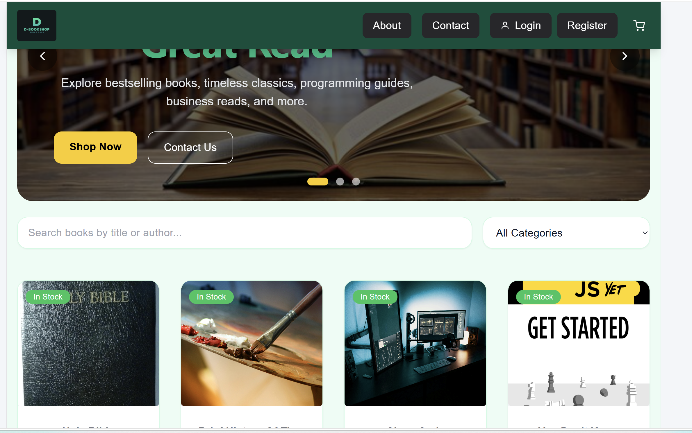
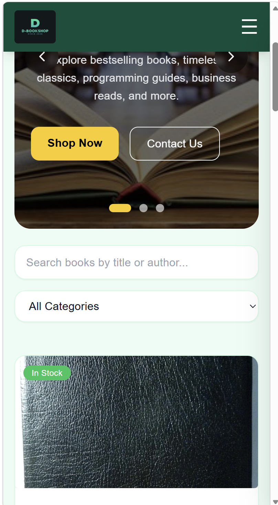
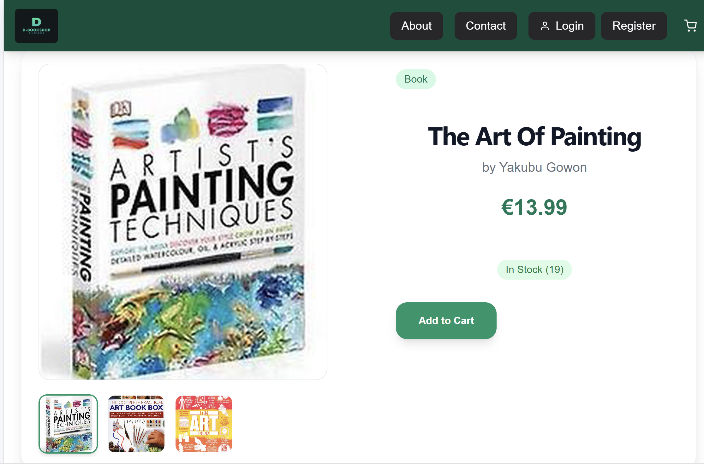
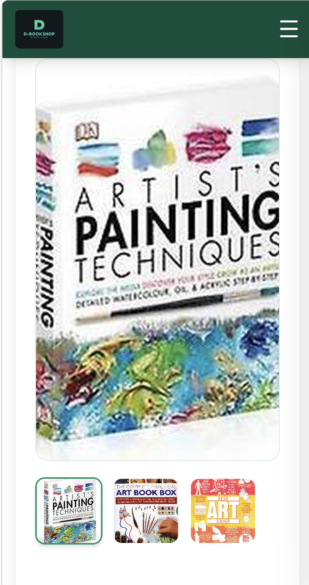
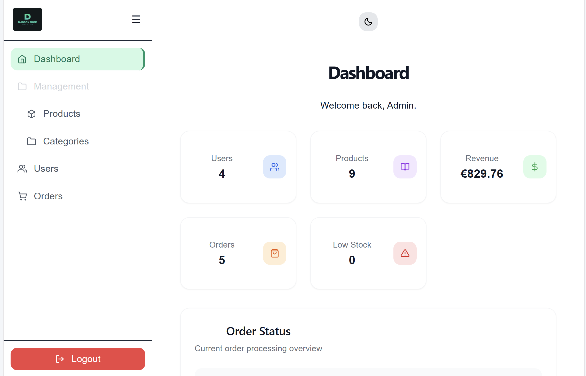
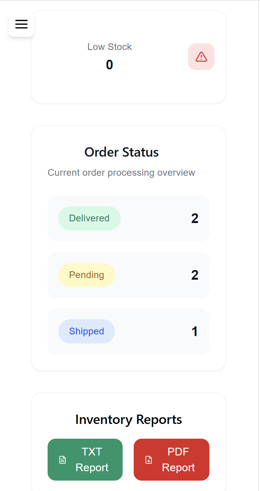
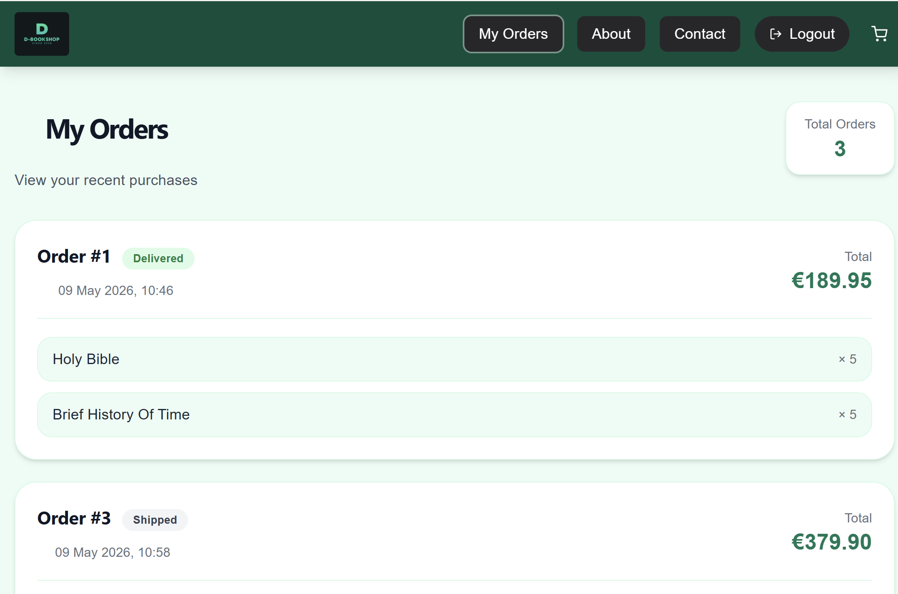
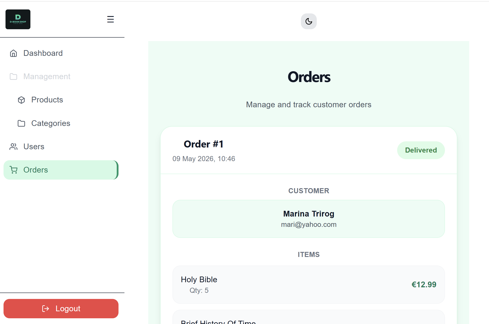
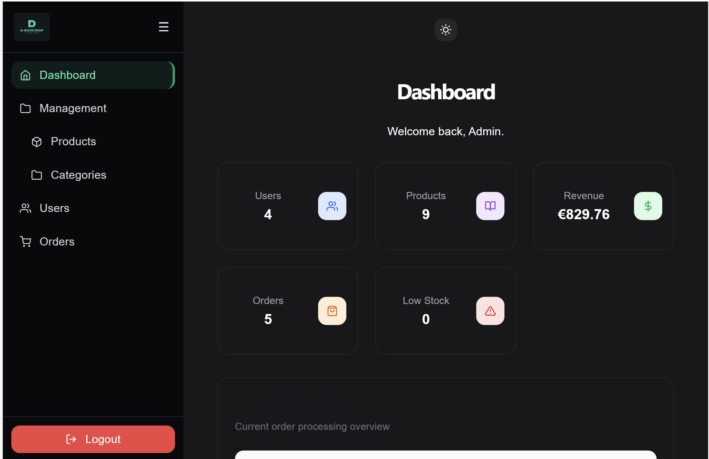
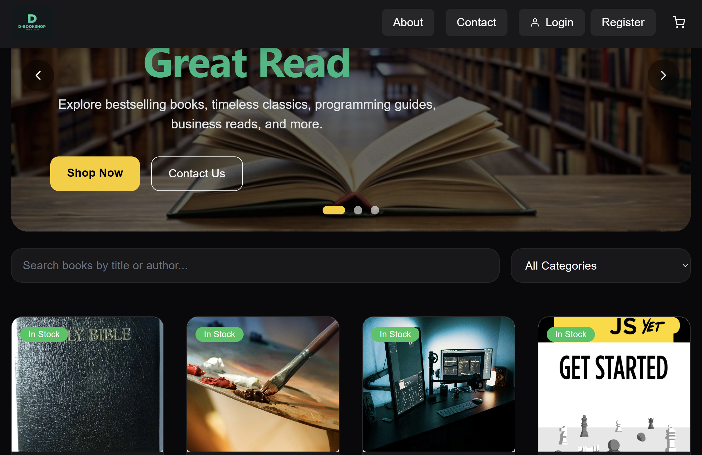

# 📚 D-BookShop

### A modern full-stack e-commerce bookstore application built with React, Node.js, Express, and SQLite/PostgreSQL-ready architecture. D-BookShop provides a complete online bookstore experience with customer ordering, admin management, authentication, reporting, image uploads, responsive UI, and dark/light theme support.


## ✨ Features
### 👤 Customer Features
- ### User registration & login
- ### JWT authentication
- ### Browse books/products
- ### Product search & category filtering
- ### Product detail pages with gallery
- ### Shopping cart functionality
- ### Order checkout system
- ### View customer orders
- ### Responsive modern UI
- ### Dark / Light mode support

## 🛠️ Admin Features
- ### Admin dashboard
- ### Product management (CRUD)
- ### Category management
- ### Order management
- ### Order status updates
- ### Inventory tracking
- ### Low stock monitoring
- ### PDF inventory reports
- ### TXT inventory reports
- ### Image uploads using Multer


---

## 🚀 Tech Stack

### Frontend
- React (Vite)
- React Router DOM
- Tailwind CSS
- React Icons
- Lucide React
- React Toastify
- Context API
- Fetch API

### Backend
- Node.js
- Express.js
- SQLite3
- JWT Authentication
- bcryptjs
- Multer + Cloudinary (image uploads)
- dotenv
- PDFKit (PDF report generation)
- REST API Architecture

### Database
- SQLite3 (started project)
- PostgreSQL (current)

### Deployment
- Frontend: Vercel
- Backend: Render (update if needed)

## 🎨 UI Features
- Fully responsive design
- Dark / Light theme
- Tailwind utility-first styling
- Hover animations & transitions
- Modern card-based layouts
- Mobile-friendly admin dashboard


## 📁 Project Structure

```
D-BookShop/
│
├── backend/
│   ├── config/
│   ├── models/
│   ├── controllers/
│   ├── routes/
│   ├── middleware/
│   ├── database/
│   └── server.js
│
├── frontend/
│   ├── src/
│   │   ├── api/
│   │   ├── auth/
│   │   ├── layout/
│   │   ├── pages/
│   │   └── App.jsx
│   └── index.html
│
└── README.md
```

## ⚙️ Installation

```
npm install

npm install pdfkit

▶️ Run the project

npm run dev


```
## 📡 API Endpoints
```
````
### Categories

| Method | Endpoint | Description |
|--------|----------|-------------|
| GET | `/api/categories` | Get all categories |
| GET | `/api/categories/:id` | Get category by ID |
| POST | `/api/categories` | Create a new category |
| PUT | `/api/categories/:id` | Update a category |
| DELETE | `/api/categories/:id` | Delete a category |
```

```

### Products

| Method | Endpoint | Description |
|--------|----------|-------------|
| GET | `/api/products` | Get all products |
| GET | `/api/products/:id`| Get product by ID |
| POST | `/api/products` | Create a new product |
|PUT | `/api/products/:id`| Update a product |
| DELETE | `/api/products/:id`| Delete a product |

````


````

### Orders

| Method | Endpoint | Description |
|--------|----------|-------------|
| POST | `/api/orders` | Create a new order (transactional) |
| GET | `/api/orders/:user_id` | Get all orders for a user |
| PUT | `/api/orders/:id/cancel` | Cancel an order (restores stock) |
| DELETE | `/api/orders/:id` | Delete an order (optional/admin) |

````

````
### Users

| Method | Endpoint | Description |
|--------|----------|-------------|
| GET | `/api/users` | Get all users |
| GET | `/api/users/:id` | Get user by ID |
| POST | `/api/users/register` | Create a new user |
| POST | `/api/users/login` | Login user |
| DELETE | `/api/users/:id` | Delete a user |

````


````
## 📄 Reporting System

The admin dashboard supports downloadable inventory reports:

- TXT Reports
- PDF Reports

Reports are dynamically generated from inventory data.
````
````
## 🖼️ File Uploads

Product image uploads are handled using:

- Multer
- Local uploads directory
- Product gallery support
````

````

## 🔐 Business Rules
- Stock is reduced when an order is created
- Stock is restored when an order is cancelled
- Orders are transactional (safe against partial failure)
- Images are stored separately and linked via product_images table

````
````
## 🧪 API Testing (Postman)

A full Postman collection is included for testing all API endpoints.

### 📁 Location
`/docs/postman/BookShop_API.postman_collection.json`
````

````
## Setup
| Variable |	Value |
|----------|----------|
|base_url	|` http://localhost:3000`|
|token	|    Auto-generated after login|

````
````
### ▶️ How to use

1. Open Postman
2. Click **Import**
3. Select the JSON file
4. Set environment variables:

````

````
### 🔐 Authentication & Security
- JWT authentication
- Protected admin routes
- Password hashing with bcrypt
- Role-based authorization
- Secure API access

````

````
### 📦 Future Improvements
- PostgreSQL migration
- Render deployment
- Stripe payments
- Email notifications
- Wishlist system
- Advanced analytics
- Docker support
- CI/CD pipeline

````

````
## 📸 Screenshots


## Home Page





## Product details




## Admin dashboard






## Orders page




## Dark mode UI




````
````
# 📌 Current Status

This project is currently in MVP stage:
Fully functional e-commerce flow
Cloud image uploads working
Authentication and protected routes implemented
Admin + customer flows separated
````
````
# 📈 Future Improvements
- Refresh token authentication
- Payment gateway integration (Stripe)
- Email order confirmation
- Advanced filtering (price range, sorting)
- Unit & integration tests
````

````
### 👨‍💻 Author

### Dimie Egberipou

### Full Stack Software Developer
````
````
### 📜 License

### This project is licensed for educational and portfolio purposes.
````